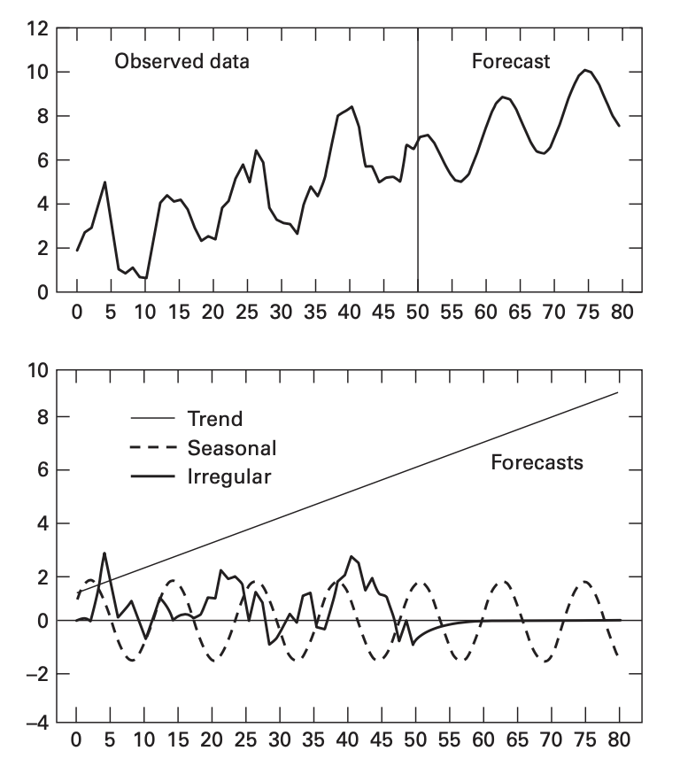

The statistical modeling of macroeconomics involves varaibles with time-series data. Time series econometrics is concerned with the estimation of difference equations that contain stochastic components. The dynamic economic models use stochastic difference equations in order to forecast variables.

It is usually possible to decompose time-series data into *trend, cyclical (or seasonal)* and *irregular* components.

- The trend component refers to the long term behaviour of the series.
- The cyclical component is the periodic regular movements in the series.
- The stochastic component is the irregular component and our goal is usually to predict this component.

The irregular component (herein called the *stochastic term*) is of particular importance to us. Although there exists no patterns in this components, positive and negative values often occur in runs. A large value is any period is followed by another large value. Also, over the entire span, the irregular component tends to revert to zero.

The objective of time-series econometrics is to find the equation of motion driving the stochastic process, and to use this equation to predict future outcomes. [^1] For example, consider a time-series of a variable $$y_t$$, where the subscript $$t$$ denotes the time. The three components could be decomposed as:

- Trend: $$ T_t = 1 +0.1 t$$,

- Cyclical: $$ S_t = 1.6 \sin \frac{t\pi}{6} $$, and,

- Irregular: $$ I_t = 0.7 I_{t-1} + \epsilon_t$$.

### Difference Equations

Difference equations are those where variables are expressed as a fuction of time, its own lagged values and other variables.  The trend and cyclical components depend on time, while the irregular component depends on lagged values and the stochastic disturbance term $$ \epsilon_t$$. As stated earlier objective is to estimate these difference equations containing stochastic components. In this accord, four difference equation models are presented here that finds application in macroeconomics and finance.

## Random Walk Hypothesis

Consider the day-to-day changes in the price of a stock. It is posited that the changes should have a mean value of 0. Effiecient speculation in the market drives up the stock price and no one would hold the stock if the price depreciates (rational investor). If $$ y_t$$ is the log of price of a share of this stock, then

$$y_{t+1} = y_t + \epsilon_{t+1}$$

$$ \Delta y_{t+1} = \epsilon_{t+1} $$

where, $$ \epsilon_{t+1} $$ is the random disturbance and has an expected value of 0. The random walk hypothesis can be tested using the following regression model.

$$ \Delta y_{t+1} = \alpha_0 + \alpha_1 y_t + \epsilon_{t+1}$$

If it turns out that $$ \alpha_0 = \alpha_1 = 0$$, then accept the random walk hypothesis and if not, reject. Further, an assumption is that the mean of $$ \epsilon_{t+1}$$ is 0. If $$ \epsilon_{t+1}$$ turns out to be predictable, even then, reject the random walk hypothesis.

## Reduced Forms and Structural Equations

A system of difference equations can be collapsed into separate single equation models. An example is the Samuelson's model (1939) given by:

$$ y_t = c_t + i_t $$

$$ c_t = \alpha y_{t-1} + \epsilon_{ct}, \ \ \ 0 <\alpha<1$$

$$ i_t = \beta(c_t -c_{t-1})+ \epsilon_{it}, \ \ \  \beta>0 $$

where the equations above measure Real GDP, Consumption and Investment expenditure respectively. Here, $$ y_t, c_t$$ and $$i_t$$ are endogeneous variables of the Keynesian model. $$y_{t-1}, c_{t-1}$$ are pre-determined/lagged endogeneous variables. $$ \epsilon_{ct},\epsilon_{it} $$ are zero mean random distubrances for consumption and investment at time $$t$$; while $$\alpha, \beta$$ are parameters to be estimated.

### Structural Equation

A *structural equation* is one which expresses an endogeneous variable as dependent on current realization of another endogeneous variable. The equation $$ i_t = \beta(c_t -c_{t-1})+ \epsilon_{it}$$  is therefore structural. Investment spending is proportional to change in consumption and consumption growth necessitates new investment spending. 

### Reduced Form Equation

A *reduced form equation* expresses value of a variable in terms of its own lags, lags of other endogeneous variables, current and past values of endogeneous variables and disturbance terms. While the equation $$ c_t = \alpha y_{t-1} + \epsilon_{ct}$$ is already in reduced form, $$ i_t = \beta(c_t -c_{t-1})+ \epsilon_{it}$$  is not so because it depends on $$c_t$$ which isn't a lag term. In order to bring it to reduced form:

$$ i_t = \beta(c_t -c_{t-1})+ \epsilon_{it}$$

$$ i_t = \beta(\alpha y_{t-1} + \epsilon_{ct} -c_{t-1})+ \epsilon_{it}$$

$$ i_t = \alpha\beta y_{t-1} - \beta c_{t-1} + \beta\epsilon_{ct} + \epsilon_{it}$$

which is now in reduced form. Reduced form solution is not unique and can incorporate lag terms too. Hence $$ c_{t-1} = \alpha y_{t-2} + \epsilon_{ct-1} $$ is also in reduced form.  Plugging this into

$$ i_t = \alpha\beta y_{t-1} - \beta c_{t-1} + \beta\epsilon_{ct} + \epsilon_{it}$$

$$ i_t = \alpha\beta y_{t-1} - \beta (\alpha y_{t-2} + \epsilon_{ct-1}) + \beta\epsilon_{ct} + \epsilon_{it}$$

$$ i_t = \alpha\beta (y_{t-1} - y_{t-2}) + \beta(\epsilon_{ct} - \epsilon_{ct-1}) + \epsilon_{it}$$

$$ y_t = \alpha y_{t-1} + \epsilon_{ct} + \alpha\beta(y_{t-1} - y_{t-2}) + \beta(\epsilon_{ct} - \epsilon_{ct-1}) + \epsilon_{it}$$

$$ y_t = \alpha(1+\beta)y_{t-1} - \alpha\beta y_{t-2} + (1+\beta)\epsilon_{ct} + \epsilon_{it} - \beta \epsilon_{ct -1}$$

$$ y_t = a y_{t-1} +b y_{t-2} +x_t$$

where $$ a = \alpha(1+\beta)$$, $$ b = -\alpha\beta$$ and $$ x_t = (1+\beta)\epsilon_{ct} + \epsilon_{it} - \beta \epsilon_{ct -1}$$. Thus, in the final equation above, $$ y_t $$ is solely expressed as a function of its own lag and thus is in the *univariate reduced form*.

### References

- Applied Econometric Time Series, 4th Edition, Walter Enders.

[^1]: Herein lies its similarity with physics.
