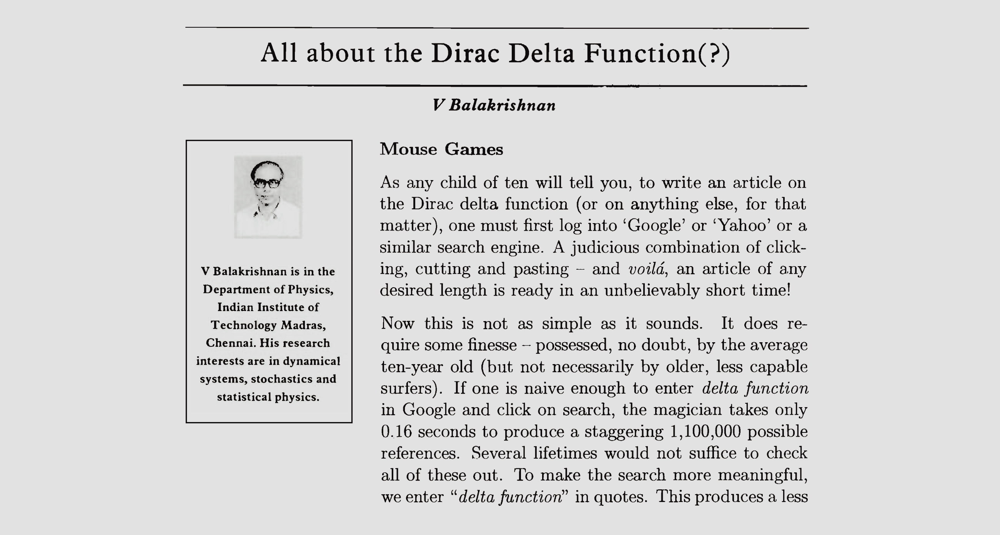

 
          

                  

                      
                  

                  

                        

                  

                        

                         

                        <!-- good blue #1E88E5 -->
                        <!-- even better blue #1976D2-->

                          <h2>  Hi. I'm Rohith,
                              a student of data science and physics.</h2>

                            <!-- Graduate Student  
                            PGDM in Business Analytics  
                            Madras School of Economics  
                            Email: <a data-toggle="tooltip"
                                     data-placement="right"
                                     title="Write to me here :)">rohithslog@gmail.com</a>  -->

                            <nav class="nav">
                              <a
                                class="nav-link col-2"
                                href="mailto:rohithslog@gmail.com"
                                target="_blank"
                                data-toggle="tooltip"
                                data-placement="bottom"
                                title="Email">
                                    <i class="fa fa-envelope-square fa-2x"></i>
                                </a>

                                <a
                                class="nav-link col-2"
                                href="https://github.com/rohithmay"
                                target="_blank"
                                data-toggle="tooltip"
                                data-placement="bottom"
                                title="Github">
                                    <i class="fa fa-github fa-2x"></i>
                                </a>

                                <a
                                class="nav-link col-2"
                                href="https://www.linkedin.com/in/rohithkris96"
                                target="_blank"
                                data-toggle="tooltip"
                                data-placement="bottom"
                                title="LinkedIn">
                                    <i class="fa fa-linkedin-square fa-2x"></i>
                                </a>

                                <a
                                class="nav-link col-2"
                                href="https://instagram.com/rohithmay"
                                target="_blank"
                                data-toggle="tooltip"
                                data-placement="bottom"
                                title="Instagram">
                                    <i class="fa fa-instagram fa-2x"></i>
                                </a>

                                <!-- <a
                                class="nav-link col-2"
                                href="https://rohithmay.wordpress.com/"
                                target="_blank"
                                data-toggle="tooltip"
                                data-placement="bottom"
                                title="Wordpress">
                                    <i class="fa fa-wordpress fa-2x"></i>
                                </a> -->

                                </nav>
                            

                        

              

<!--
Template for latest updates here
  

        

            <h6>Latest Updates</h6>
            

                <ul>
                    
                    <li>{{update}}</li>
                    
                </ul>
            

        

    
 -->

<!--  Template for new stuff here
 
  

        

            <h6>title</h6>
            <ul>

            </ul>
        

    
   -->

     

  

      

            

            <!--  For coloring words use these. Check out HTML colors   -->

            <!-- Enter contents here -->
                        

                      I'm currently in the second year of my PGDM in Research and Business Analytics at
                      Madras School of Economics, carrying out coursework in machine learning, finance, economics, linear algebra etc. I hold a Masters in physics and am skilled in computational physics and mathematical modeling.

                         

                    <!--   -->
                    <!-- good moderate blue here #1976D2 use this for buttons -->
                    <!--  #D6EAF8 is light blue -->
                    <!-- #1976D2 is the custom blue used in the page -->
                    <!-- #BBDEFB is almost teal. Satisfactory in a white backgorund. Too creamy? -->

                    <a href="/resume/rohith-krishna-cv.pdf">
                    <button type="button" class="btn btn-primary" style="background-color: #1976D2; border-color: #1976D2; color:white;" > <strong>📃 My CV </strong></button> </a>

                    <a href="/projects">
                  <button type="button" class="btn btn-primary" style="background-color: #1976D2; border-color: #1976D2; color:white;" > <strong>👨🏻‍💻 Projects </strong></button> </a>

                    <a href="/blog">
                    <button type="button" class="btn btn-primary" style="background-color: #1976D2; border-color: #1976D2; color:white;" > <strong>🖋️ Blog </strong></button> </a>

                    <a href="/rbi2020">
                    <button type="button" class="btn btn-primary" style="background-color: #1976D2; border-color: #1976D2; color:white;" > <strong>🏦 Exchange Rate Volatility</strong></button> </a>

                    <!-- <a href="/resume/rohith-krishna-cv.pdf">
                    <button type="button" class="btn btn-light active" > <strong>📃 My CV </strong></button> </a>

                    <a href="/projects">
                  <button type="button" class="btn btn-light active" aria-pressed="true" > <strong>👨🏻‍💻 Projects </strong></button> </a>

                    <a href="/blog">
                    <button type="button" class="btn btn-light active" aria-pressed="true" > <strong>🖋️ Blog </strong></button> </a>

                    <a href="/rbi2020">
                    <button type="button" class="btn btn-light active" aria-pressed="true" > <strong>🏦 Exchange Rate Volatility</strong></button> </a> -->

                       

                    

                          

                              <h6>Updates</h6>
                              

                                  <ul>
                                      
                                      <li>{{update}}</li>
                                      
                                  </ul>
                              

                          

                      

                       

                    

                    <!-- <a href="#" class="btn btn-light active" role="button" aria-pressed="true"> -->
                    <button type="button" class="btn btn-light active" aria-pressed="true"  >
                    

                    

                    <!-- </a> -->
                    <b> Article of the Week </b>  
                    <em> <small>October 10, 2020 </small></em>  

                        
                          

                        <small> In this article Prof. V Balakrishnan <em>(or Balki as we call him)</em> writes about the history of the Dirac Delta <em>function</em> and its importance in physics. He explains why the Dirac delta makes sense when it occurs in an integral, why it appears in physics problems and why Paul Dirac himself required it. However, the most amusing thing about this article published in Resonance in 2003 is Balki's fascinating exercise of googling different variations of "the Dirac delta function" and his awe at the magnitude and speed of search results. <a href="https://www.ias.ac.in/article/fulltext/reso/008/08/0048-0058" target="_blank"> Check out the article here. </a> </small> 

                    </button>
                     
                    
  
                    <!-- <em>  

                    Joscha BAch quote here

                     Nerds need to interface with the society in non-standard ways. Sometimes, I define a nerd as someone who thinks that the purpose of communication is to submit your ideas to peer-review. Normal people understand that the purpose of communication is to negotiate alignment and these purposes tend to conflict, which means the nerds have to learn how to  interact with society at large. ~ Joscha Bach. </em> -->

                    <!-- <a href="/rbi2020">
                    <button type="button" class="btn btn-primary" style="background-color: #BBDEFB; border-color: #BBDEFB; color:black;"> <strong>🏦 Exchange Rate </strong></button> </a> -->

<!--    To check if katex is installed. It isn't 2020-08-10. Moved to Mathjax.                 
                    

  The KaTeX stylesheet is not loaded!
  KaTeX stylesheet version: 
 -->

<!--

                        I'm a student of data science and am currently carrying coursework in the areas of machine learning, finance, linear algebra etc.     

                        This site is both a repository of my projects & notes on topics in economics, data science and quantum computing and also my blog where I post occasional musings.     -->

                        <!--  For colored boxes

                        

                        <h1>  Hey! </h1>
                        
   -->

                        <!-- Quick links to my project pages:   -->

                          <!--
                                          I am a student of data science currently in my second year of PGDM, carrying out coursework in fields such as machine learning, finance and economics. Prior to this, I pursued a Masters course in physics with skills in computational physics and mathematical modeling.       

                                          This webpage is a repository of my projects and academic notes, predominantly in the fields of machine learning, macroeconomics, corporate finance, linear algebra and quantum computing. This page also doubles as my blog where I post occasional musings on life as it ebbs and flows. -->

                                                  <!-- <a href="/rbi2020">
                                                  <button type="button" class="btn btn-secondary"> <strong> Exchange Rate Volatility </strong></button> </a> -->

                                                  <!-- <a href="https://rohithmay.github.io/macroeconomics-20">
                                                  <button type="button" class="btn"> <strong> Macroeconomics </strong> </button> </a>  -->

                        

                         

<!--

                
 -->

                <!-- thick horizontal line above -->
                <!-- For a thin line use the code below -->
                <!-- 
 -->
                 

            

        

<!-- UPDATES INFO - code backup

      

          <h6>Updates</h6>
          

              <ul>
                  
                  <li>{{update}}</li>
                  
              </ul>
          

      

  

     
 -->

    <!--      -->
          

    

        

        <i class="fa fa-copyright" aria-hidden="true"></i> 2020 Rohith Krishna,

            <i class="fa fa-code" aria-hidden="true"></i>
            on <a href="https://getbootstrap.com" target="_blank">Bootstrap</a> & <a href="https://jekyllrb.com/" target="_blank">Jekyll</a>. 
        

    

